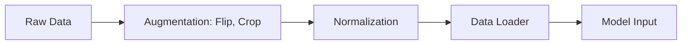

# Báo cáo Bài Tập Lớn 1: Phân Loại Hình Ảnh & Xử Lý Ngôn Ngữ Tự Nhiên

## 1. Giới Thiệu
Báo cáo này tập trung vào các kỹ thuật phân loại hình ảnh (image classification), xử lý ngôn ngữ tự nhiên (NLP for topics), và các mô hình đa phương thức (multimodal models - CLIP).

### Video Demo & Thuyết Trình
- **Video Demo:** [Link (Placeholder)](https://youtube.com)
- **YouTube Presentation:** [Link (Placeholder)](https://youtube.com)
- **Source Code:** [GitHub Repo (Placeholder)](https://github.com)

---

## 2. Phân Tích Dữ Liệu (EDA)
Tóm tắt các đặc điểm chính của tập dữ liệu CIFAR-10 và Yahoo Answers.

| Dataset | # Samples | # Classes | Resolution | Distribution |
| :--- | :--- | :--- | :--- | :--- |
| CIFAR-10 | 60,000 | 10 | 32x32 | Balanced |
| Yahoo Answers | 1,4M | 10 | Text | Long-tail |

---

## 3. Data Pipeline
Sử dụng PyTorch DataLoader với các kỹ thuật Augmentation để cải thiện độ hội tụ.

---

## 4. Huấn Luyện & Kết Quả

### CNN vs ViT (Vision Transformer)
Kết quả so sánh giữa mô hình mạng nơ-ron tích chập và Transformer cho hình ảnh.

| Model | Acc (%) | Loss | Params (M) | FPS |
| :--- | :---: | :---: | :---: | :---: |
| ResNet-18 (CNN) | 90.5 | 0.25 | 11M | 150 |
| ViT-Base (Transformer) | 92.1 | 0.21 | 86M | 45 |

### RNN/LSTM vs Transformer (NLP)
So sánh mô hình tuần tự truyền thống và cơ chế Attention.

### CLIP Zero-shot & Few-shot
Đánh giá độ chính xác khi không huấn luyện (Zero-shot) và huấn luyện một phần (Few-shot).

---

## 5. Phân Tích Mở Rộng

### Grad-CAM Representation
Trực quan hóa vùng quan tâm của mô hình.

### Phân Tích Lỗi (Error Analysis)
Phân tích các trường hợp mô hình phân loại sai thông qua Confusion Matrix.

---
[Quay lại Trang Chủ](../)
