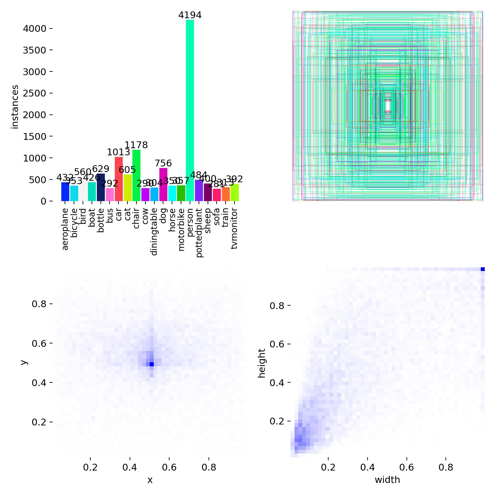
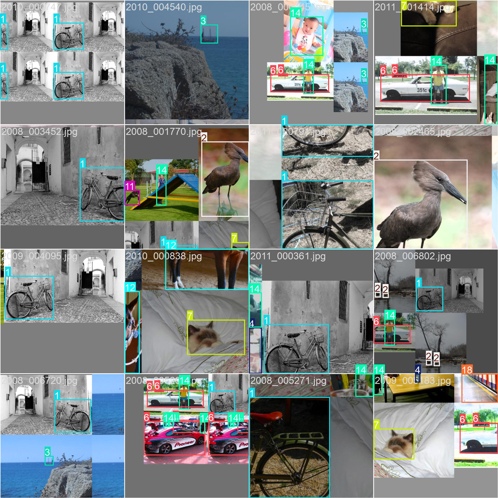
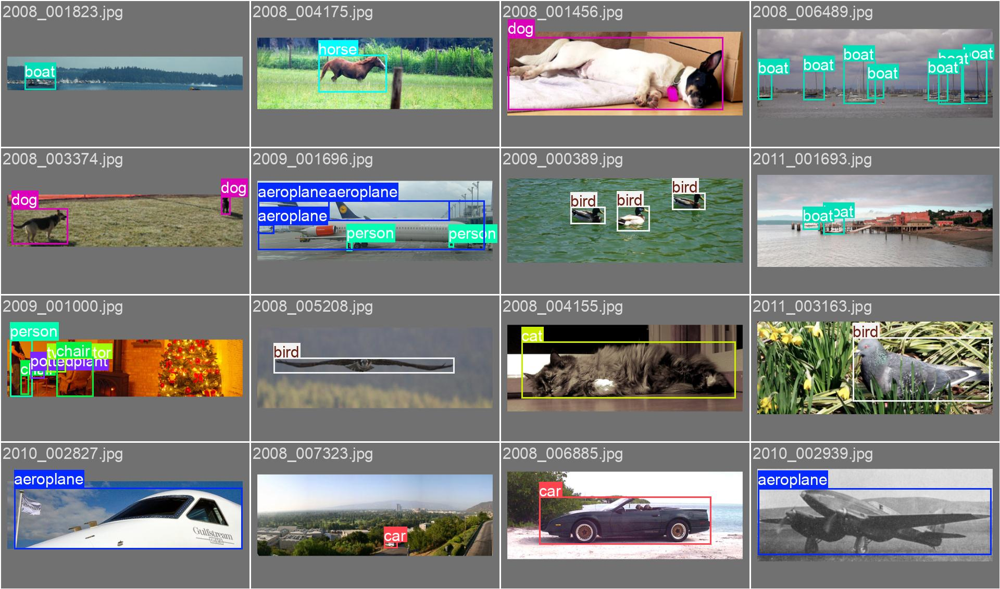

[← BTL2](./)

# 2. Dataset, DataLoader & Augmentation

Phần này mô tả cách chuẩn bị dữ liệu cho hai pipeline: **YOLOv8 (Ultralytics)** và **Faster R-CNN**. Điểm khác biệt chính nằm ở format nhãn, transform và cách đóng gói batch.

<div class="toc">
  <strong>Mục lục</strong>
  <ul>
    <li><a href="#dataset">2.1 Cấu trúc dataset & splits</a></li>
    <li><a href="#yolo-format">2.2 Chuyển đổi VOC → YOLO format</a></li>
    <li><a href="#dataloader">2.3 DataLoader cho Faster R-CNN</a></li>
    <li><a href="#augment">2.4 Augmentation & normalization</a></li>
  </ul>
</div>

## 2.1 Cấu trúc dataset & splits

- Tập dữ liệu gốc: **VOC2012** với annotation XML theo chuẩn Pascal VOC.
- Sử dụng các file split chuẩn trong `ImageSets/Main` để tách train/val.
- Dữ liệu đầu vào gồm ảnh (JPEG) và nhãn (XML) theo từng ảnh.

<div class="callout">
  <strong>Lưu ý:</strong> Trong EDA có thể gán split ngẫu nhiên để thống kê. Trong huấn luyện, dùng split chuẩn của VOC để tái lập kết quả.
</div>

## 2.2 Chuyển đổi VOC → YOLO format

YOLO yêu cầu label dạng txt với mỗi dòng: `class_id cx cy w h` (tọa độ chuẩn hóa 0-1). Pipeline chuyển đổi:

1. Đọc XML để lấy bbox theo `[xmin, ymin, xmax, ymax]`.
2. Lọc `difficult=1` để tránh nhiễu khi train.
3. Chuẩn hóa tọa độ về kích thước ảnh gốc.
4. Copy ảnh và sinh file label tương ứng.

Cấu trúc đầu ra:

```
yolo_dataset/
├── images/
│   ├── train/
│   └── val/
└── labels/
    ├── train/
    └── val/
```

File cấu hình `voc_data.yaml`:

- `nc = 20`
- `names = {0: 'aeroplane', ..., 19: 'tvmonitor'}`
- `train = images/train`
- `val = images/val`

## 2.3 DataLoader cho Faster R-CNN

Pipeline Faster R-CNN cần format target đặc thù:

- `boxes`: tensor `[xmin, ymin, xmax, ymax]` (tọa độ tuyệt đối)
- `labels`: tensor lớp, **dịch +1** để giữ `0` làm background
- `collate_fn`: trả về `list[targets]` thay vì stack nhãn

Bộ dataset custom đọc XML, apply transform và trả về `(image, target)` cho từng ảnh.

## 2.4 Augmentation & normalization

**Faster R-CNN (Albumentations):**

- `LongestMaxSize(max_size=512)` + `PadIfNeeded(512×512)`
- `HorizontalFlip(p=0.5)`
- `ColorJitter(brightness, contrast, saturation, hue)`
- Normalize chỉ **chia 255** (mean=0, std=1) để tránh double-normalization

**YOLOv8 (Ultralytics):**

- Resize/letterbox tự động theo `imgsz`
- Augment mặc định (mosaic, HSV, flip, scale) được cấu hình bởi Ultralytics

<div class="two-col">
  <figure class="figure">
    
    <figcaption>Minh họa label sau khi chuyển đổi sang YOLO format.</figcaption>
  </figure>
  <figure class="figure">
    
    <figcaption>Batch train sau augmentation (mosaic/flip).</figcaption>
  </figure>
</div>

<figure class="figure">
  
  <figcaption>Ảnh validation với nhãn ground-truth.</figcaption>
</figure>

---
[← BTL2](./) 
