[← BTL2](./) | [← Trang Chủ](../)

# 1. EDA: Pascal VOC 2012

Phần EDA tập trung vào việc hiểu cấu trúc dữ liệu, phân bố lớp, đặc trưng bounding box và các yếu tố ảnh hưởng đến huấn luyện/đánh giá mô hình.

  

    
Total images

    
17,125

  

  

    
Bounding boxes

    
40,138

  

  

    
Classes

    
20

  

  

    
Objects / image

    
2.34

  

  

    
Difficult

    
11.1%

  

  

    
Truncated

    
43.8%

  

  <strong>Mục lục</strong>
  <ul>
    <li><a href="#phan-bo-lop">1.1 Phân bố lớp</a></li>
    <li><a href="#bbox-stats">1.2 Đặc trưng bounding box</a></li>
    <li><a href="#phan-bo-vi-tri">1.3 Phân bố vị trí & số object/ảnh</a></li>
    <li><a href="#properties">1.4 Đặc điểm ảnh</a></li>
    <li><a href="#mau-sac">1.5 Phân bố màu</a></li>
    <li><a href="#cooccurrence">1.6 Đồng xuất hiện lớp</a></li>
  </ul>

  <strong>Insight nhanh:</strong> Lớp <code>person</code> chiếm ~43.4% tổng object, imbalance ~25x (max/min). Điều này tác động trực tiếp đến per-class mAP và cần cân nhắc khi so sánh mô hình.

## 1.1 Phân bố lớp

  <figure class="figure">
    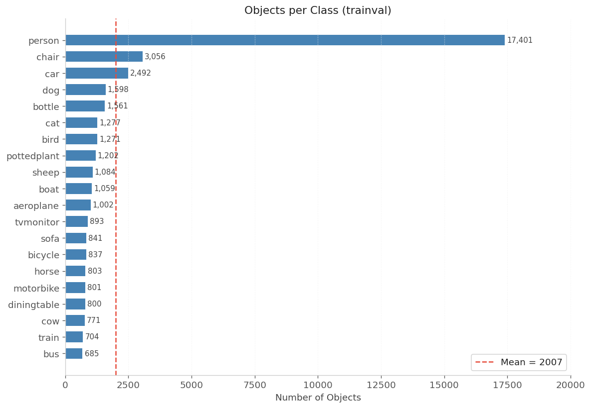
    <figcaption>Phân bố số lượng object theo lớp (trainval).</figcaption>
  </figure>
  <figure class="figure">
    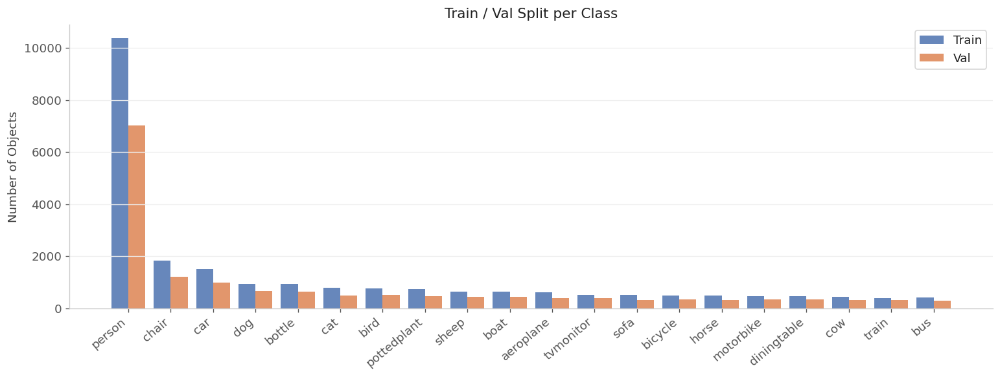
    <figcaption>Phân bố object theo train/val cho từng lớp.</figcaption>
  </figure>

<figure class="figure">
  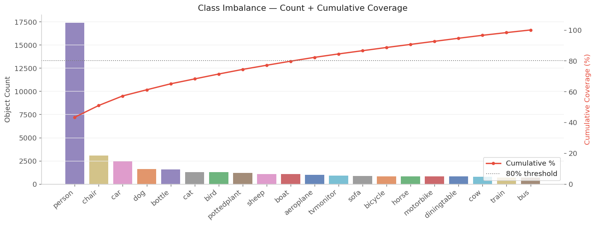
  <figcaption>Pareto chart thể hiện mức độ mất cân bằng lớp và coverage tích lũy.</figcaption>
</figure>

## 1.2 Đặc trưng bounding box

  <figure class="figure">
    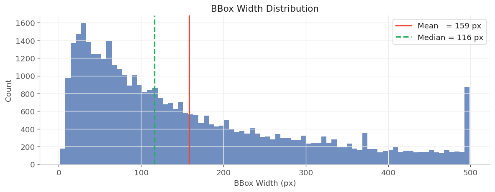
    <figcaption>Phân bố chiều rộng bounding box (px).</figcaption>
  </figure>
  <figure class="figure">
    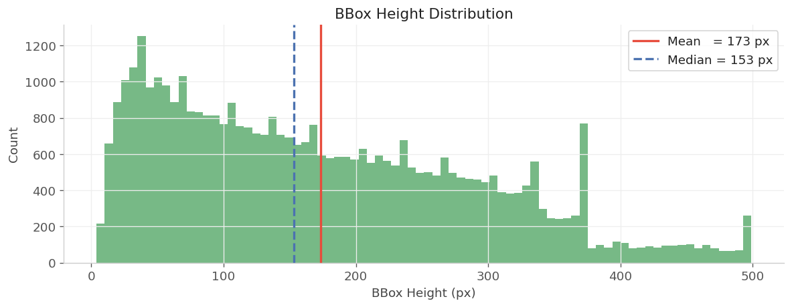
    <figcaption>Phân bố chiều cao bounding box (px).</figcaption>
  </figure>

  <figure class="figure">
    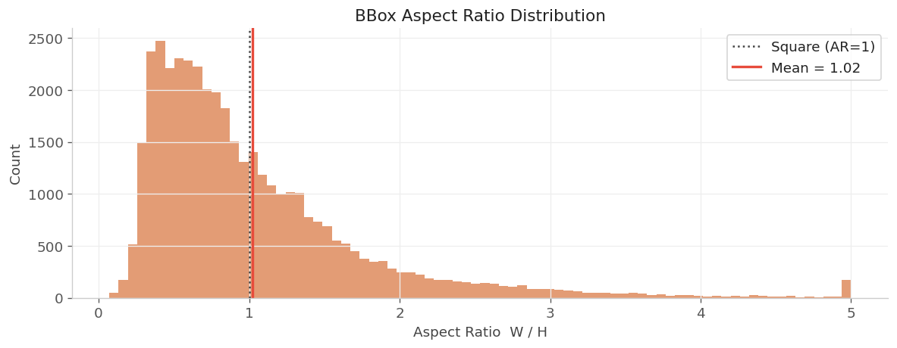
    <figcaption>Tỷ lệ W/H (cắt ngưỡng 5) cho thấy nhiều object rộng hơn cao.</figcaption>
  </figure>
  <figure class="figure">
    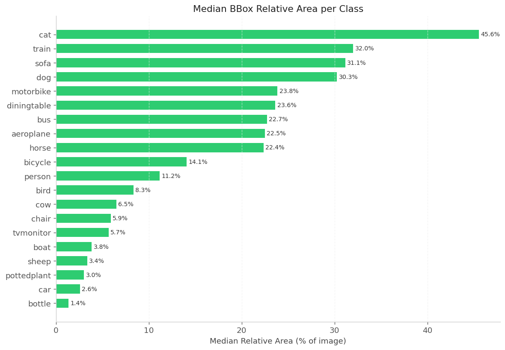
    <figcaption>Median diện tích bbox theo lớp, gợi ý sizing anchor/feature map.</figcaption>
  </figure>

## 1.3 Phân bố vị trí & số object/ảnh

  <figure class="figure">
    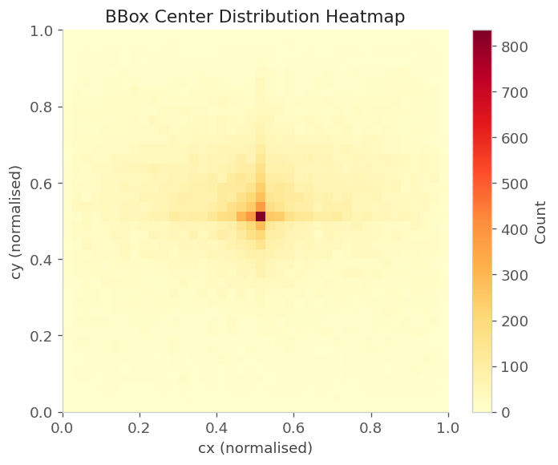
    <figcaption>Heatmap vị trí tâm bbox (chuẩn hóa 0-1).</figcaption>
  </figure>
  <figure class="figure">
    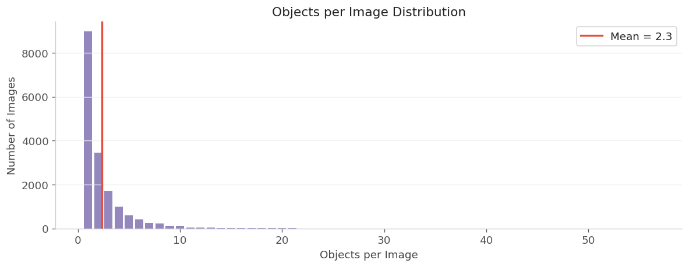
    <figcaption>Đa số ảnh có &lt; 5 object, một số ảnh đông người có tới 50+ object.</figcaption>
  </figure>

## 1.4 Đặc điểm ảnh

  <figure class="figure">
    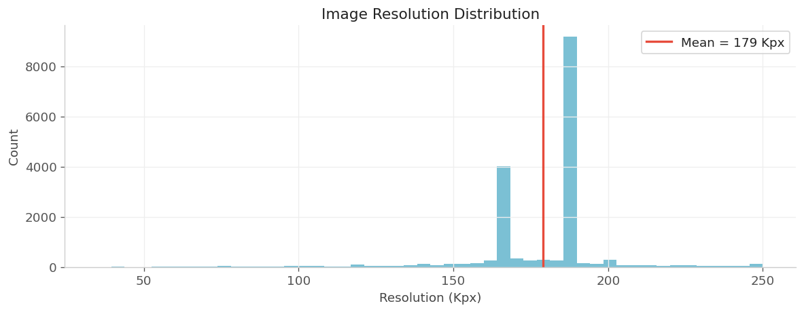
    <figcaption>Độ phân giải ảnh tập trung quanh các kích thước 500×375 và 375×500.</figcaption>
  </figure>
  <figure class="figure">
    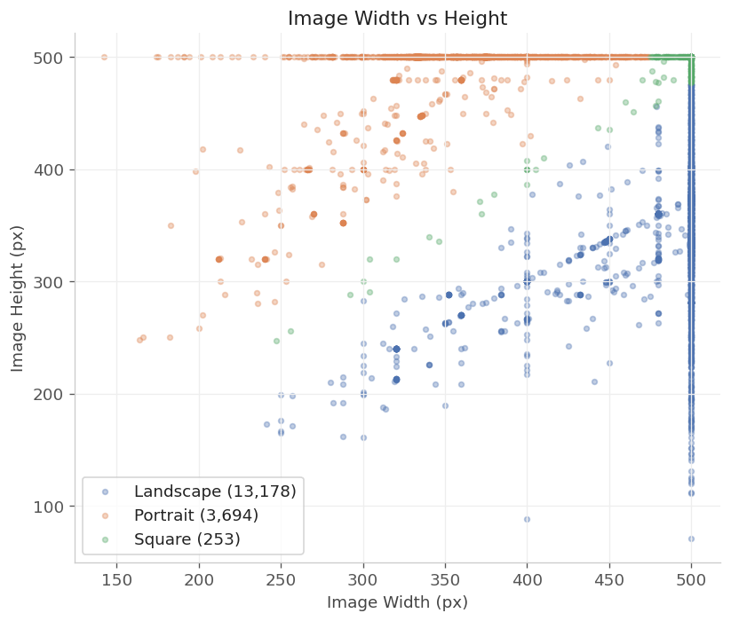
    <figcaption>Ảnh có cả hướng ngang và dọc, cần resize/pad ổn định.</figcaption>
  </figure>

## 1.5 Phân bố màu

  <figure class="figure">
    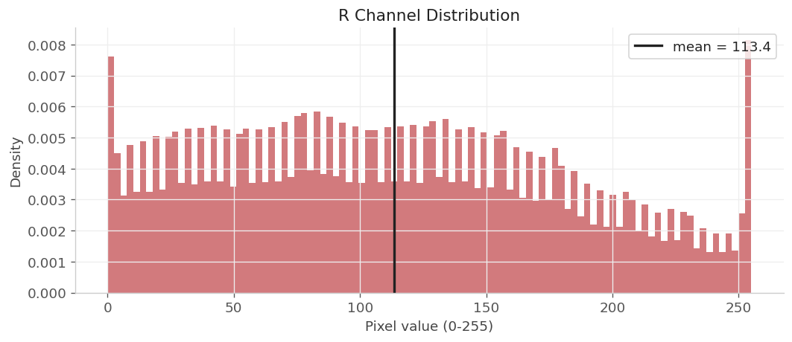
    <figcaption>Kênh R: phân bố pixel gần chuẩn ImageNet.</figcaption>
  </figure>
  <figure class="figure">
    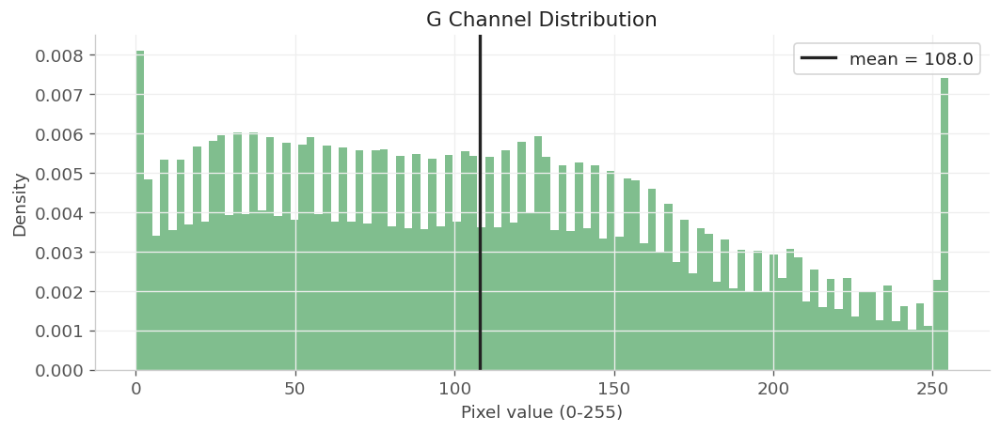
    <figcaption>Kênh G: phù hợp với ImageNet normalization.</figcaption>
  </figure>

<figure class="figure">
  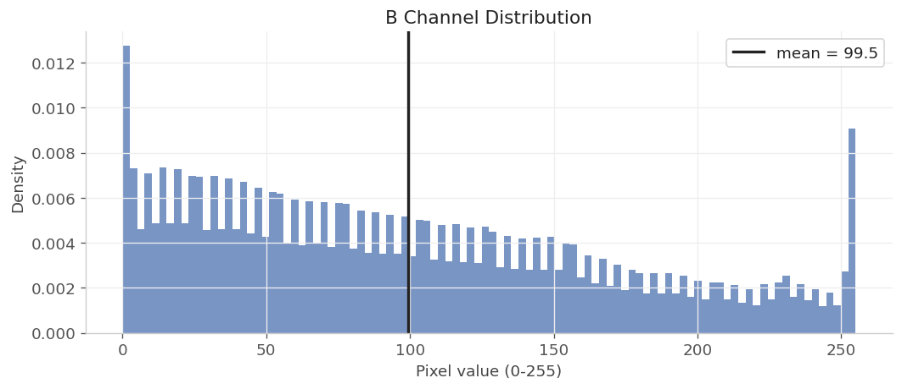
  <figcaption>Kênh B: trung bình thấp hơn R/G, vẫn phù hợp dùng ImageNet mean/std.</figcaption>
</figure>

## 1.6 Đồng xuất hiện lớp

  <figure class="figure">
    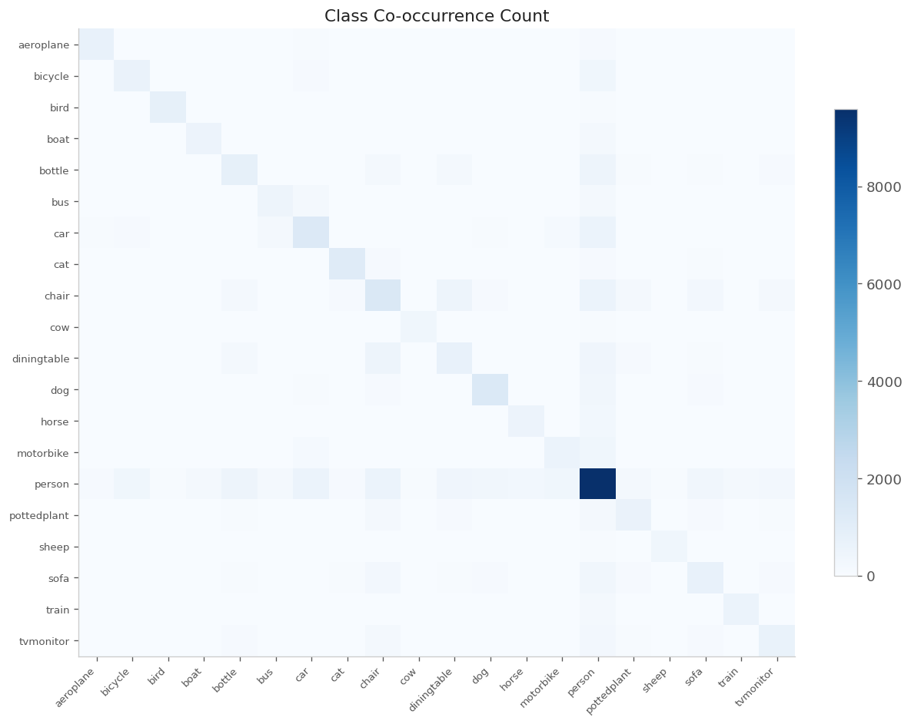
    <figcaption>Ma trận đếm đồng xuất hiện, lớp <code>person</code> nổi bật.</figcaption>
  </figure>
  <figure class="figure">
    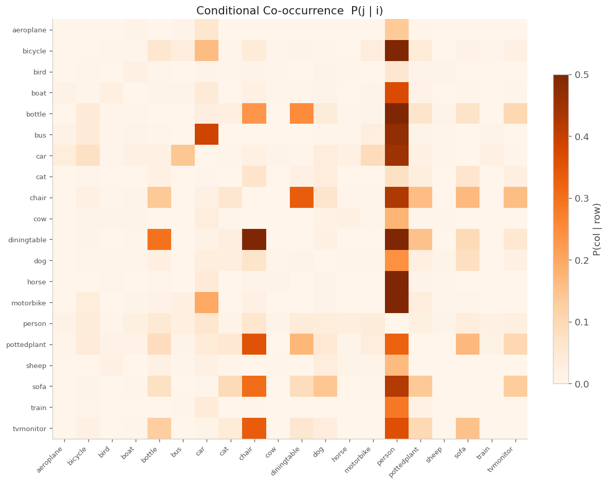
    <figcaption>Xác suất có điều kiện P(j | i) cho thấy các cặp dễ nhầm.</figcaption>
  </figure>

  <strong>Gợi ý phân tích lỗi:</strong> Các cặp như <code>chair</code> ↔ <code>diningtable</code> và <code>person</code> ↔ <code>bottle</code> thường đồng xuất hiện, nên ưu tiên kiểm tra confusion matrix theo các cặp này.

---
[← BTL2](./) | [← Trang Chủ](../)
