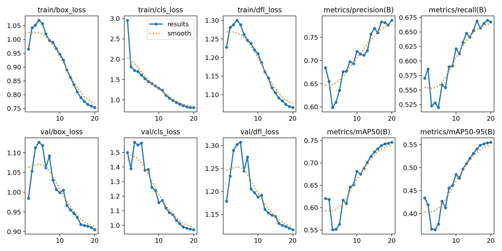
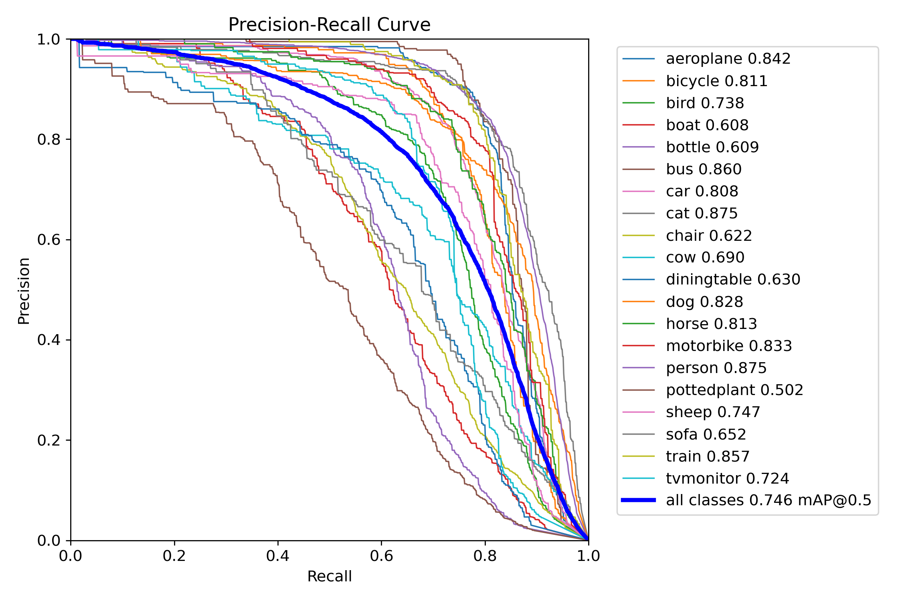
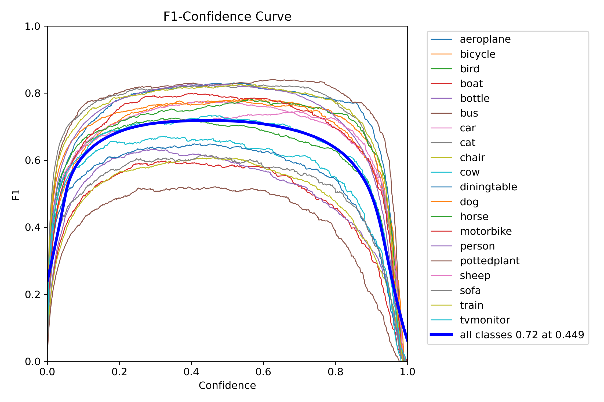
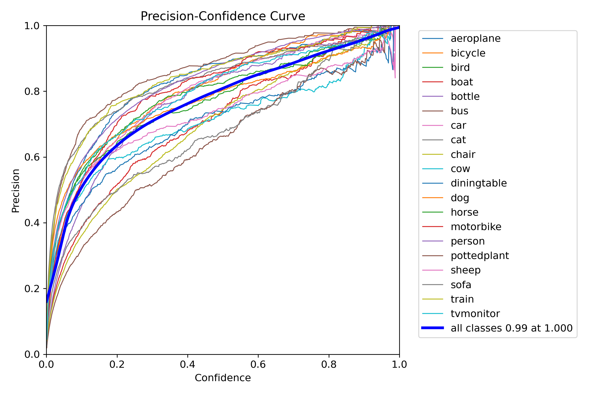
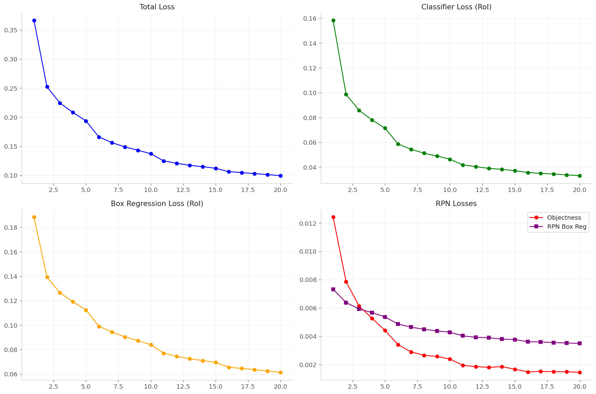
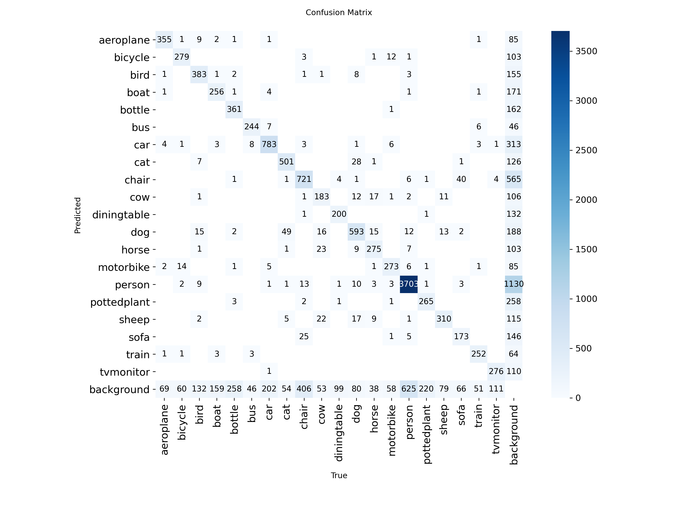
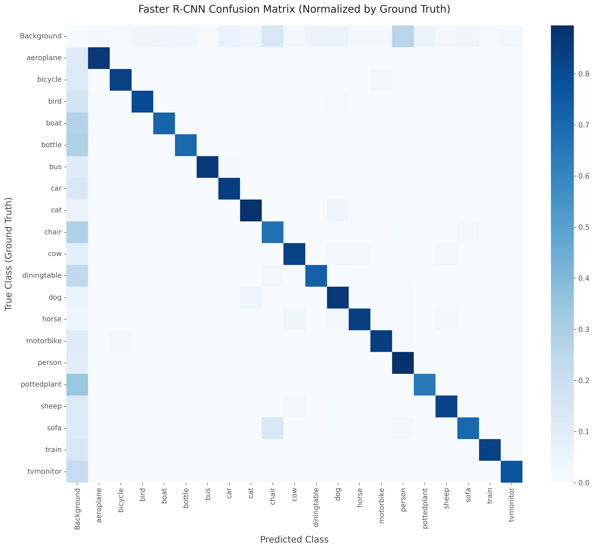
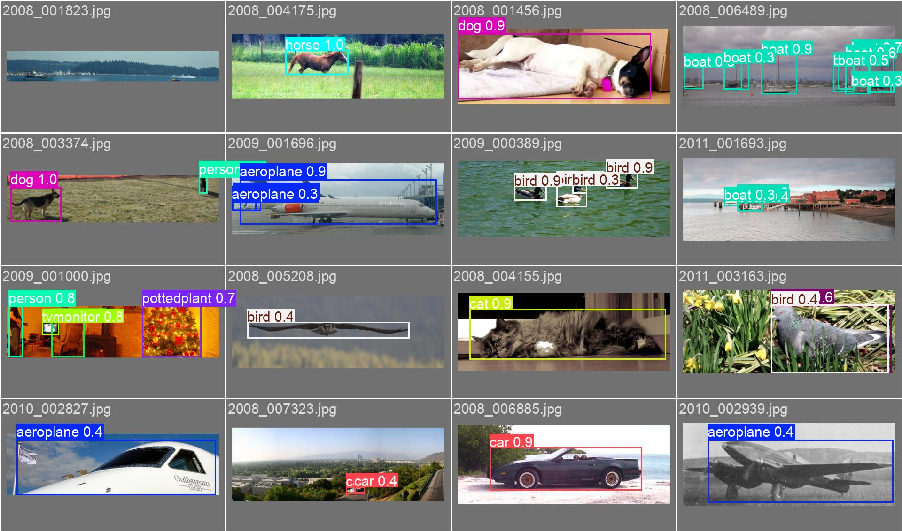
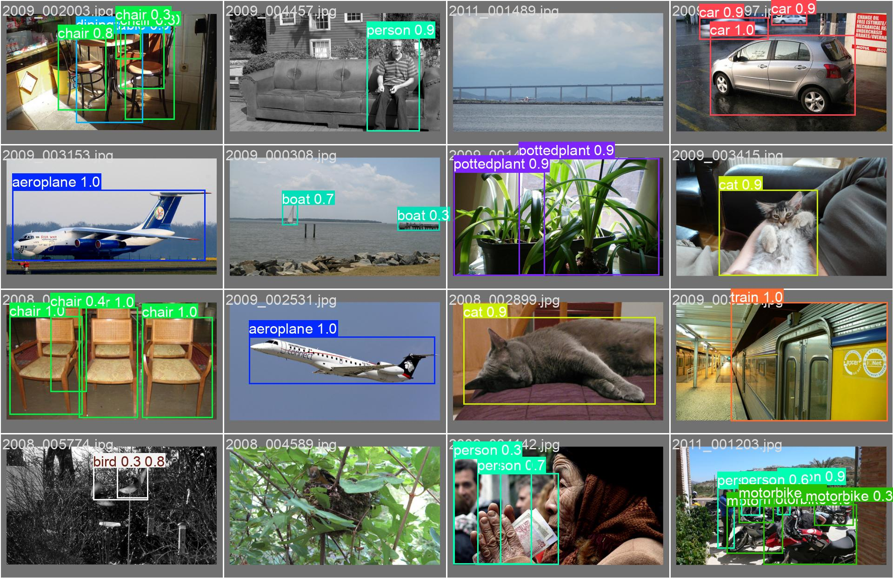
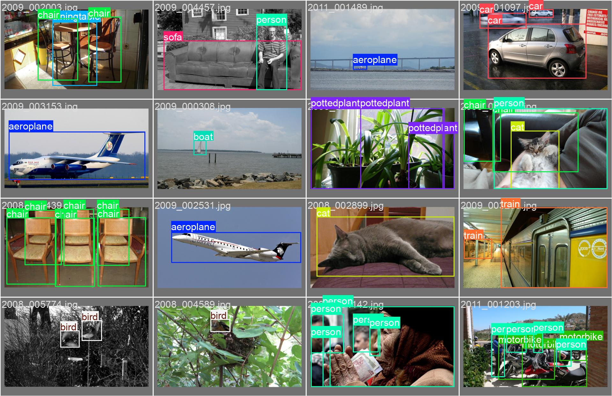

[← BTL2](./) | [← Trang Chủ](../)

# 4. Kết quả thực nghiệm: bảng số liệu, biểu đồ, phân tích

Phần này tổng hợp các kết quả định lượng (mAP, precision, recall), biểu đồ huấn luyện và phân tích định tính bằng hình ảnh.

  <strong>Mục lục</strong>
  <ul>
    <li><a href="#summary">4.1 Bảng tổng hợp kết quả</a></li>
    <li><a href="#yolo-curves">4.2 YOLOv8: đường cong huấn luyện</a></li>
    <li><a href="#frcnn-curves">4.3 Faster R-CNN: loss curves</a></li>
    <li><a href="#confusion">4.4 Confusion matrix</a></li>
    <li><a href="#qualitative">4.5 Kết quả định tính</a></li>
    <li><a href="#discussion">4.6 Thảo luận</a></li>
  </ul>

## 4.1 Bảng tổng hợp kết quả

| Mô hình      | Precision       | Recall          | mAP50     | mAP50-95  | Ghi chú                           |
| ------------ | --------------- | --------------- | --------- | --------- | --------------------------------- |
| YOLOv8 Nano  | 0.787           | 0.667           | 0.746     | **0.555** | Ultralytics, 20 epochs, imgsz=512 |
| Faster R-CNN | (không công bố) | (không công bố) | **0.758** | 0.508     | Torchmetrics, ResNet50 FPN        |

  <strong>Nhận xét:</strong> Faster R-CNN nhỉnh hơn về mAP50, trong khi YOLOv8 tốt hơn ở mAP50-95 và tốc độ. Đây là trade-off phổ biến giữa 2-stage và 1-stage detector.

## 4.2 YOLOv8: đường cong huấn luyện

  <figure class="figure">
    
    <figcaption>YOLOv8: precision/recall/mAP theo epoch.</figcaption>
  </figure>
  <figure class="figure">
    
    <figcaption>PR curve cho bbox (Ultralytics).</figcaption>
  </figure>

  <figure class="figure">
    
    <figcaption>F1-score theo threshold.</figcaption>
  </figure>
  <figure class="figure">
    
    <figcaption>Precision theo threshold.</figcaption>
  </figure>

## 4.3 Faster R-CNN: loss curves

<figure class="figure">
  
  <figcaption>Loss curves theo epoch (total, classifier, box reg, RPN).</figcaption>
</figure>

## 4.4 Confusion matrix

  <figure class="figure">
    
    <figcaption>Confusion matrix YOLOv8 (normalized).</figcaption>
  </figure>
  <figure class="figure">
    
    <figcaption>Confusion matrix Faster R-CNN (normalized).</figcaption>
  </figure>

## 4.5 Kết quả định tính

  <figure class="figure">
    
    <figcaption>YOLOv8: dự đoán trên batch val (pred).</figcaption>
  </figure>
  <figure class="figure">
    
    <figcaption>YOLOv8: ground-truth trên batch val (labels).</figcaption>
  </figure>

  <figure class="figure">
    
    <figcaption>YOLOv8: dự đoán trên batch val (batch 1).</figcaption>
  </figure>
  <figure class="figure">
    
    <figcaption>YOLOv8: ground-truth trên batch val (batch 1).</figcaption>
  </figure>

## 4.6 Thảo luận

- YOLOv8 đạt mAP50-95 tốt hơn nhưng dễ bỏ sót object nhỏ trong các ảnh đông người.
- Faster R-CNN có độ chính xác cao hơn ở IoU=0.5, phù hợp khi ưu tiên độ đúng hơn tốc độ.
- Mất cân bằng lớp (person chiếm ưu thế) khiến các lớp hiếm khó đạt mAP cao, thể hiện rõ trong confusion matrix.
- Bản chất VOC có nhiều object trung tâm ảnh, do đó các mô hình có prior center hoạt động tốt.

---
[← BTL2](./) | [← Trang Chủ](../)
