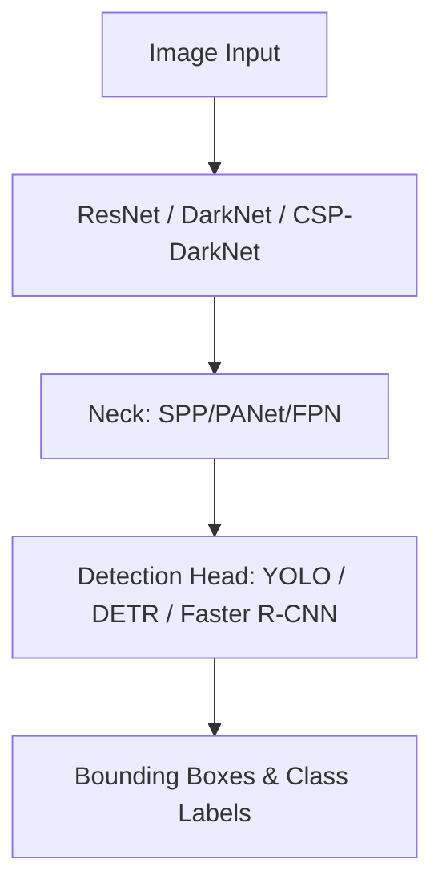

# Báo cáo Bài Tập Lớn 2: Phát Hiện Vật Thể (Object Detection)

## 1. Giới Thiệu
Báo cáo này tập trung vào bài toán phát hiện vật thể (Object Detection) sử dụng các kiến trúc hiện đại nhất hiện nay.

### Video Demo & Thuyết Trình
- **Video Demo:** [Link (Placeholder)](https://youtube.com)
- **YouTube Presentation:** [Link (Placeholder)](https://youtube.com)
- **Source Code:** [GitHub Repo (Placeholder)](https://github.com)

---

## 2. Dữ Liệu Huấn Luyện
Sử dụng tập dữ liệu COCO (Hoặc tập dữ liệu của nhóm đã thu thập).

- **Số lượng nhãn (Classes):** 80
- **Số lượng ảnh huấn luyện:** 118,000
- **Số lượng ảnh kiểm thử:** 5,000

---

## 3. Kiến Trúc Mô Hình
So sánh giữa các dòng mô hình Single-stage (YOLO), Two-stage (Faster R-CNN) và Transformer-based (DETR).

---

## 4. Đánh Giá Hiệu Năng (mAP / FPS)

| Model Architecture | BackBone | mAP@0.5 (%) | mAP@0.5:.95 (%) | FPS (RTX 3070) |
| :--- | :--- | :---: | :---: | :---: |
| YOLOv8-n (Nano) | DarkNet | 37.3 | 25.1 | 185 |
| YOLOv10-s (Small)| - | 45.1 | 30.5 | 110 |
| Faster R-CNN | ResNet-50 | 48.0 | 33.2 | 15 |
| DETR | ResNet-50 | 50.1 | 35.5 | 28 |

---

## 5. Kết Luận
Phân tích điểm mạnh và điểm yếu của từng mô hình dựa trên độ chính xác và tốc độ xử lý thời gian thực.

---
[Quay lại Trang Chủ](../)
